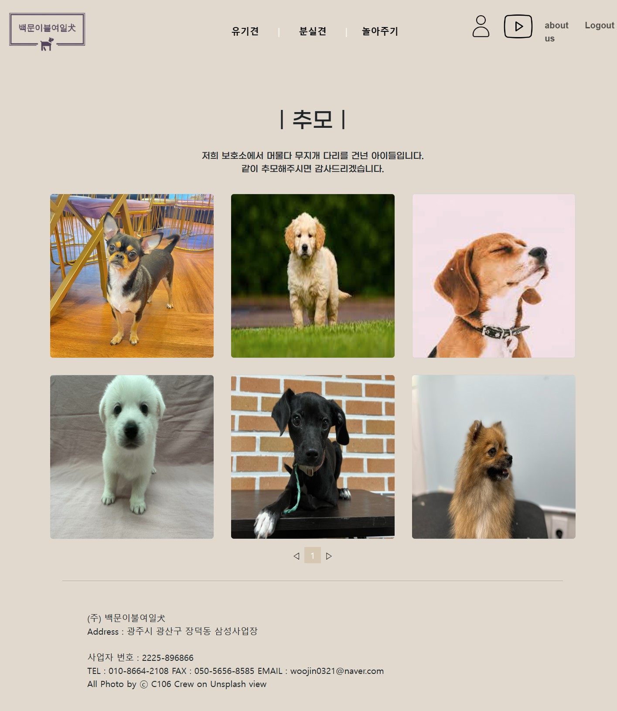

 

### IoT 기기를 활용한 유기동물 가족찾기 프로젝트!

 

잃어버린 강아지를 찾고 싶으신가요?
 
우리 가족과 어울릴 강아지를 인도적으로 입양하고 싶으신가요?

### IoT 기기를 활용해 먼저 놀아보고, 입양을 결정할 수 있는 서비스

 

## **백문이불여일犬**을 소개합니다. 😜

 
 

# 🐕‍🦺 불여일犬만의 특별한 기능

### 1. 보호센터 사이트를 통한 입양

### 2. 원격 로봇을 통한 놀아주기

### 3. 분실견 찾기(Soon!)

 

## 목차

#### [개요](#개요)

#### [팀 소개](#-팀-소개)

#### [기획배경 및 타겟](#-기획배경-및-타겟)

#### [파트별 기능구현 소개](#파트별-기능구현-소개)

#### [서비스화면](#서비스화면)

#### [사용기술스택](#-사용기술스택)

#### [시스템아키텍쳐](#-시스템-아키텍쳐)

#### [산출물](#-산출물)

#### [협업툴](#-협업툴)

 

## 개요

- 기간 : 2023.07.10. ~ 2023.08.18.

- SSSSS 9기 공통PJT IoT 프로젝트

## ✨ 팀 소개

|   **Name**   |                                          정진솔                                          |                                          이민규                                          |                                          이재명                                          |                                          김택우                                          |                                          김태빈                                          |                                          최우진                                          |
| :----------: | :--------------------------------------------------------------------------------------: | :--------------------------------------------------------------------------------------: | :--------------------------------------------------------------------------------------: | :--------------------------------------------------------------------------------------: | :--------------------------------------------------------------------------------------: | :--------------------------------------------------------------------------------------: |
| **Profile**  |  |  |  |  |  |  |
| **Position** |                                   **Leader   IoT**                                   |                             **Backend Infra** **PM**                             |                                     **Backend **                                     |                                       **IoT **                                       |                                       **Frontend**                                       |                                       **Frontend**                                       |

 

## 기획배경 및 타겟

 
- 기획 배경

    1. 유기동물을 입양하는 과정이 복잡하고, 센터에 직접 방문하여 수기로 작업하는 경우가 많습니다.
    2. 사람에 대한 두려움으로 강아지의 본모습을 보호센터에서 보기 힙듭니다
    3. 센터에 지내는 강아지는 인력 운동량이 현저히 적을 수 밖에 없습니다.
    4. 입양 예정인과 유대감을 충분히 쌓지 못하고 입양을 진행하는 경우가 많습니다.

 
- 타겟층

    - 센터에 자주 방문할 수 없는 입양 희망자
    - 강아지와 놀고 싶은 봉사활동 희망자

## 파트별 기능구현 소개

### 👩 Front-end

#### 1. 회원가입 및 로그인 기능 구현: 사용자 인증을 위해 JWT 토큰을 활용

#### 2. 게시판 기능: 입양 정보와 유기동물에 관한 정보를 제공하는 게시판을 구현

#### 3. 알림 기능: 놀아주기 예정 시간에 예약한 사용자만 알림을 실시간으로 전달하는 기능을 제공

#### 4. 실시간 통신: WebSocket을 활용한 실시간 영상 송수신 구현

### 👨 Back-end

#### 1. 회원가입 및 로그인 처리: 사용자 정보를 안전하게 저장하고 관리하며, JWT 토큰을 발급하여 인증을 제공

#### 2. 게시판 관리: 게시물을 생성, 수정, 삭제하고, 사용자의 요청에 따라 정보를 제공

#### 3. WebSocket 통신 지원: 실시간으로 IoT 기기와 사용자 간의 영상을 WebSocket을 통해 전달하는 기능 구현

### 🐕‍🦺 IoT

#### 1. IoT 기기 제작: 라즈베리파이와 3D프린터, 모터, 카메라 등을 활용해 기기를 직접 설계 및 제작.

#### 2. WebSocket 통신: IoT 디바이스와 서버 간의 WebSocket을 통해 구현하여 영상을 실시간으로 송신

## 사용기술스택

- Frontend
  - React
  - css
  - javascript
- Backend
  - Database: MariaDB
  - Web: NestJS, WebSocket, JWT
- IoT
  - Python
  - WebSocket
- Deploy
  - Docker
  - Nginx
- Server
  - AWS EC2

 

| Tech         | Stack               |
| ------------ | ------------------- |
| **Language** | JavaScript, HTML5   |
| **Backend**  | TypeScript NestJS   |
| **Frontend** | React, JavaScript   |
| **Database** | MariaDB             |
| **IoT**      | Python, RaspberryPi |
| **Server**   | AWS EC2             |
| **DevOps**   | Git, Docker,Nginx   |

 

## 시스템아키텍쳐

 

 

## 컴포넌트 트리

## IOT 기기

## 서비스화면

|        IoT 실시간 구동 동영상         |
| :-----------------------------------: |
|  |
|  |

|            메인 페이지             |
| :--------------------------------: |
|  |

|              로그인 페이지              |            마이페이지            |
| :-------------------------------------: | :------------------------------: |
|  |  |

|              입양 가이드              |           IoT 이용 가이드           |
| :-----------------------------------: | :---------------------------------: |
|  |  |

|              유기견 페이지              |              분실견 페이지              |
| :-------------------------------------: | :-------------------------------------: |
|  |  |

|         놀아주기 강아지 추천          |          놀아주기 예약 페이지           |          강아지 상세 페이지           |
| :-----------------------------------: | :-------------------------------------: | :-----------------------------------: |
|  |  |  |

|              놀아주기 페이지              |
| :---------------------------------------: |
|  |

|          유기견 추가 페이지           |          유기견 수정 페이지           |          분실견 추가 페이지           |
| :-----------------------------------: | :-----------------------------------: | :-----------------------------------: |
|  |  |  |

|          추모 페이지           |          입양 완료 페이지           |
| :----------------------------: | :---------------------------------: |
|  |  |

 

## 산출물

### - PPT

[공통PJT*광주\_1반\_C106*발표자료.pptx](./exec/공통PJT_광주_1반_C109_발표자료.pptx) (\*.pptx)

### - 포팅 매뉴얼

[포팅 매뉴얼](./exec/readme.md) (\*.md)

### - 빌드파일

[ 빌드 파일](./exec/exec.zip) (\*.zip)
